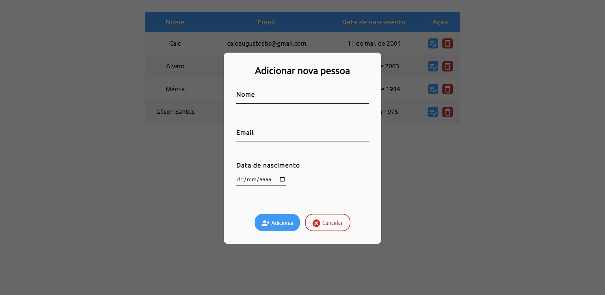

<h1 align="center">Lista de pessoas cadastradas</h1>
<h4 align="center">Agora você pode facilmente ver, adicionar, editar ou excluir pessoas de uma lista de cadastro</h4>
<h4 align="center">Feito com HTML, CSS e JavaScript</h4>

&#xa0;

**
Sumário
**

<a href="#dart-sobre">Sobre</a> &#xa0; | &#xa0;
<a href="#white_check_mark-funcionalidades">Funcionalidades</a> &#xa0; | &#xa0;
<a href="#computer-tecnologias">Tecnologias</a> &#xa0; | &#xa0;
<a href="#hammer_and_wrench-serviços">Serviços</a>

<a href="#camera-imagens">Imagens</a> &#xa0; | &#xa0;
<a href="#orange_book-como-usar">Como usar</a> &#xa0; | &#xa0;
<a href="#scroll-pré-requisitos">Pré-requisitos</a> &#xa0; | &#xa0;
<a href="#link-links">Links</a> &#xa0; | &#xa0;
<a href="#sparkles-autor">Autor</a>

## :dart: Sobre

Esse projeto foi um desafio técnico para desenvolver, em até 7 dias, um CRUD dos seguintes dados referentes a uma pessoa: nome, email, data de nascimento. Consiste em uma aplicação que permite o usuário adicionar, editar ou excluir pessoas de uma lista, de forma fácil e simples.

Foi escolhido o localStorage para armazenar os dados, pois qualquer usuário que acessar o link da aplicação terá acesso ao armazenamento facilmente.

Veja a <a href="https://github.com/CaioAugustoHD/CRUD/blob/main/Lista%20de%20execu%C3%A7%C3%A3o%20de%20tarefas.md">Lista de execução de tarefas</a>

&#xa0;

## :white_check_mark: Funcionalidades
As principais funcionalidades do projeto são:

✔️ Exibir uma lista de pessoas cadastradas;

✔️ Permitir o usuário adicionar uma ou mais pessoas à lista;

✔️ Permitir o usuário editar os dados de alguma pessoa da lista;

✔️ Permitir o usuário remover alguma pessoa da lista;

✔️ Validar se os dados da pessoa (nome, email e data de nascimento) são válidos;

✔️ Validar se o email ainda não está cadastrado ao adicionar ou editar alguma pessoa da lista;

✔️ Exibir uma mensagem de erro caso algum dado seja inválido;

✔️ Armazenar todos os dados no localStorage do navegador.

&#xa0;

## :computer: Tecnologias
* [HTML](https://developer.mozilla.org/pt-BR/docs/Web/HTML)

* [CSS](https://developer.mozilla.org/pt-BR/docs/Web/CSS)

* [JavaScript](https://www.javascript.com/)

&#xa0;

## :hammer_and_wrench: Serviços
* <a href="https://github.com/">GitHub</a>

* <a href="https://www.netlify.com/">Netlify </a>- hospedagem

* <a href="https://fonts.google.com/">Google Fonts </a>- importação da fonte e dos ícones
* <a href="https://animista.net/">Animista </a>- coleção de animações CSS

&#xa0;

## :camera: Imagens
**
Exemplo de funcionamento:
**

  

**
Lista de pessoas em desktop:
**

  

**
Adicionar pessoa à lista:
**

  

**
Lista de pessoas em mobile:
**

  

**
Editar dados de uma pessoa:
**

  

&#xa0;

## :orange_book: Como usar

Acesse a aplicação pelo link. A lista não aparecerá caso não tenha nenhuma pessoa cadastrada.

Para adicionar uma nova pessoa, clique no botão "Adicionar", preencha todos os dados corretamente e confirme sua ação. Caso os dados preenchidos forem válidos, ela já será exibida na lista. Você pode adicionar várias pessoas, mas não pode cadastrar alguém com um email que já está cadastrado!

Para editar os dados de alguém, basta clicar no botão azul na linha da pessoa desejada, fazer as alterações e salvar.

Para remover alguém, clique no botão vermelho (com desenho de uma lixeira) da pessoa desejada e confirme sua ação ao aparecer a mensagem de alerta.

Todos os dados são salvos no localStorage do seu navegador. Logo, se o site for fechado, você pode abrir novamente e seus registros ainda estarão ali.

**
⚠️ Caso você limpe os dados de navegação, os dados do localStorage do seu navegador serão apagados.
**

&#xa0;

## :scroll: Pré requisitos
Para utilizar o sistema, basta um navegador de sua preferência e conexão com internet.

&#xa0;

## :link: Links
* Repositório: https://github.com/CaioAugustoHD/Lista-pessoas-cadastradas
* Deploy: https://pessoas-cadastradas.netlify.app/

&#xa0;

## :sparkles: Autor
<h4>Feito por Caio Augusto Pereira</h4>

&#xa0;

 

